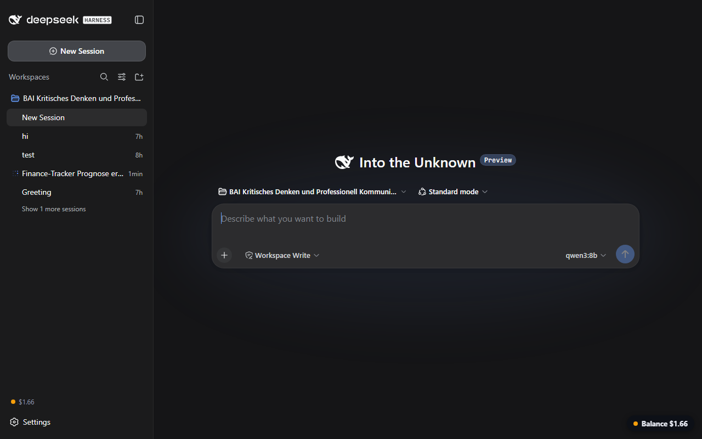

# dsh-balance-chip

Show your **DeepSeek API balance directly inside the DSH app**, in two places:

1. **Bottom-right pill** – always visible, non-blocking (`pointer-events: none`), dot + amount, auto-refresh every 60 s
2. **Sidebar footer** – beside Settings (dot in rail mode)



- 🟢 green ≥ $5 · 🟠 orange < $5 · 🔴 red on errors
- Tooltip shows currency and last update time
- **Your API key never ships with this plugin** – it is read at runtime from your local DSH credential store, and the only network call goes to the official `api.deepseek.com/user/balance` endpoint from the host side.

## Prerequisites

Your DeepSeek API key must be stored in the DSH credential store under the reference **`DEEPSEEK_API_KEY`** (this is the same place the built-in DeepSeek provider uses – the web UI's Models page writes it there). If the reference is missing, the displays show `Key?`.

## Install

```sh
dsh plugin --profile web add github:AKUSH99/dsh-balance-chip
```

Restart `dsh web` (or use the market's one-click restart). No build step, no dependencies.

Requires dsh web `0.1.0-rc.6` or newer (same base as the plugin market).

## Installation alternatives

- **Plugin Market:** once listed, open Settings → Plugin Market in the app, search "balance", one-click install.
- **Prebuilt package:** the [latest release](https://github.com/AKUSH99/dsh-balance-chip/releases/latest) ships a ready tarball – the market offers it as the faster install path without any build step.

## How it works

| Part | What it does |
|---|---|
| `lib/index.js` (host) | Resolves the key via the `credentials` service, polls `GET https://api.deepseek.com/user/balance` every 60 s, serves the cached state at `GET /dsh-balance` |
| `client/client.js` (web) | Registers a `sidebar.footer.action` item **and** a `shell.overlay` pill that fetch `/dsh-balance` and render dot + amount |

No telemetry, no external dependencies, everything stays on your machine.

## Troubleshooting

- **`Key?` in the chip/pill** – no `DEEPSEEK_API_KEY` reference in your credential store. Store your key via the web UI's Models page (or the `credentials` service), then reload.
- **`…` while loading** – the first poll hasn't finished yet; wait a few seconds.
- **Red dot / error** – the host couldn't reach `api.deepseek.com/user/balance`; check your network and key validity.

## 中文说明

在 DSH 应用内实时显示 DeepSeek API 余额：右下角常驻胶囊（不阻挡点击）+ 侧边栏底部状态点，每 60 秒自动刷新。余额低于 5 美元显示橙色，出错显示红色，悬停可见币种与更新时间。**API Key 绝不内置**：运行时从本机 DSH 凭证库读取，仅向官方余额接口发起请求。使用前请确认凭证库中存在 `DEEPSEEK_API_KEY` 引用（与内置 DeepSeek 提供方相同，网页端模型页面会写入）。

## FAQ

**Why two displays?** The sidebar chip is subtle and always in reach; the bottom-right pill gives an at-a-glance status without blocking clicks (`pointer-events: none`).
**How fresh is the value?** The host polls the official balance endpoint every 60 seconds; both displays refresh from that cached state.
**Does polling cost tokens?** No – the balance endpoint is separate from the chat API and does not consume paid tokens.
**Currency?** The official API reports the account currency; the displays show it as-is.

## License

MIT
